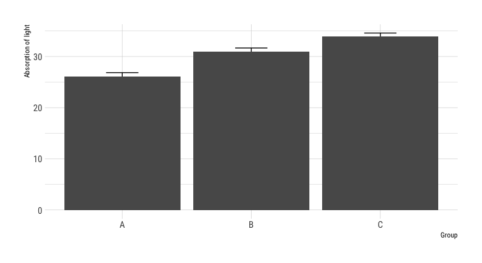
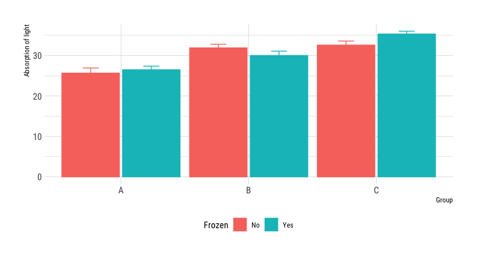
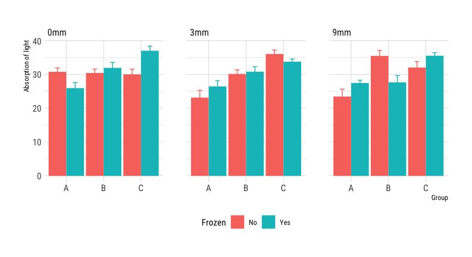
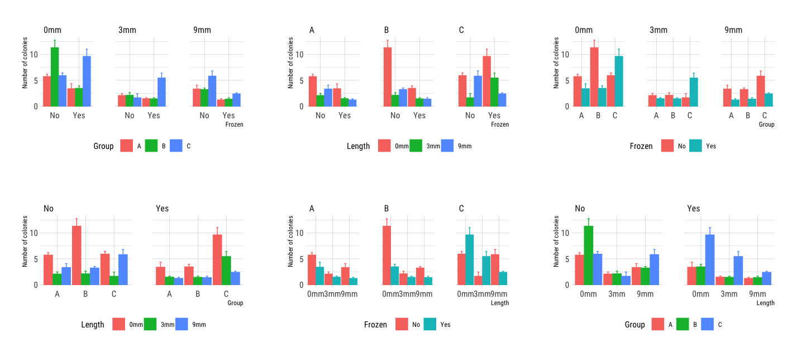
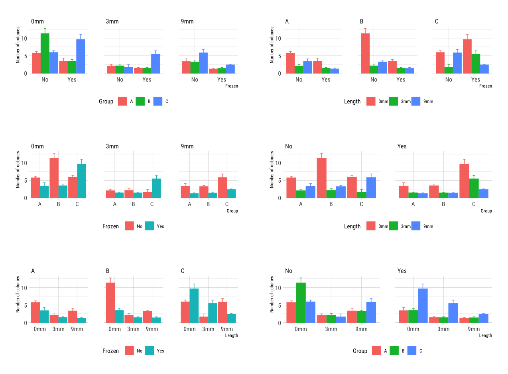

# multiplot
Easily plot multiple plots to one figure

### Example data

```r
> dat <- readRDS("example_data.rds")
> summary(dat)
    Length             Frozen             Group           Absorption of light Number of colonies
 Length:270         Length:270         Length:270         Min.   : 8.688      Min.   :-6.799    
 Class :character   Class :character   Class :character   1st Qu.:26.189      1st Qu.: 1.424    
 Mode  :character   Mode  :character   Mode  :character   Median :30.768      Median : 3.036    
                                                          Mean   :30.331      Mean   : 3.928    
                                                          3rd Qu.:35.547      3rd Qu.: 5.768    
                                                          Max.   :48.196      Max.   :22.019    
```

Example data is `data.table` object. Data in drawn from normal distribution and has 15 observations for each Length, Frozen and Group combination.

### Required libraries

Library `gtools` is required for `permutations()` function.

Libraries `ggplot2`, `hrbrthemes`, `ggpubr` and `cowplot` are used for actual plotting. One can use either `ggpubr` for `ggarrange()` or `cowplot` for `plot_grid`. There's an example of both.

### Functions

Function `single.plot()` utilises R's `aes_string()` function to properly wrap `ggplot()` arguments which are given as input arguments for `single.plot()`. This function creates a bar chart with error whiskers as `ggplot` object. Function uses ipsum theme from `hrbrthemes` package (this is optional, but makes plot nicer).

Optionally, line-connected scatter plots can be produced and parts of the code are provided and commented out.

One can give 1-3 parameters to plot by.

```r
single.plot(response = "`Absorption of light`", params = c("Group"))
```



```r
single.plot(response = "`Absorption of light`", params = c("Group", "Frozen"))
```



```r
single.plot(response = "`Absorption of light`", params = c("Group", "Frozen", "Length"))
```



Function `multiplot()` creates every possible combination of given parameter levels and call for `single.plot()` with R's built-in `apply()` function.

One can call `multiplot()` by itself and it returns a `list` of `ggplot` objects, but this result can be readily forwarded to `ggarrange()` function from `ggpubr` library or to `plot_grid()` function from `cowplot` library.

```r
ggarrange(plotlist = multiplot("`Number of colonies`", c("Group", "Frozen", "Length")))
```



```r
cowplot::plot_grid(ncol = 2, plotlist = multiplot("`Number of colonies`", c("Group", "Frozen", "Length")))
```



As one can see, `plot_grid()` takes an argument `ncol` which defines that the plot grid should have two columns and all the plots should be arranged by that.
